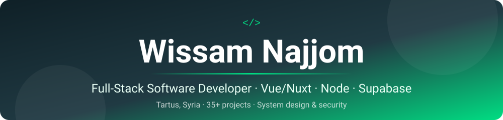

 

**مطوّر واجهات أمامية من طرطوس، سوريا. أبني مواقع سريعة وتطبيقات متعددة المنصات.**

---

## 👋 About me

I'm a **Front-End Developer based in Tartus, Syria**, specialized in **Vue.js and Nuxt (SSR / SSG / SPA)**. Over 3+ years I've delivered **35+ projects** across e-commerce, e-learning, school management, real estate, medical and sports, with many reaching **90+ Lighthouse scores**.

- ⚡ Cut average page-load time by **~30%** with code splitting, lazy loading and asset optimization
- 🖥️📱 Turn web apps into native-like **desktop (Electron Forge)** and **mobile (Capacitor)** apps
- 🌍 Comfortable with **Arabic (RTL) / English (LTR)** multilingual products
- 🧑‍🏫 Mentored 5+ trainees and ran structured code reviews
- 🎓 B.Sc. in Informatics Engineering, Tishreen University (2025)
- 🤖 Daily user of AI tools (Claude, Gemini, DeepSeek) to move faster without lowering the bar

---

## 🛠️ Tech stack

**Frontend**

**Cross-platform & Backend**

**Tools**

UI libraries: Vuetify · PrimeVue · Pinia · @nuxtjs/i18n · PWA / Workbox · Capacitor

---

## 🚀 Featured projects

### ⭐ [KKit](https://github.com/wissam333/KKit): a free, serverless Swiss Army knife for the web
Peer-to-peer **video calls, screen sharing, live whiteboard and file chat** over WebRTC, **Telegram power tools** (GramKit), and a **multiplayer WW1 dogfight game** built on Canvas, all with **zero backend cost**. Installable PWA, Arabic + English.
`Nuxt 3` `Vue 3` `WebRTC` `PeerJS` `GramJS` `PWA` · [Live demo](https://kkit.wissam-n-najjom.workers.dev/)

### 🌐 Selected client work

| Project | Type | Link |
| --- | --- | --- |
| **Hamasat Perfumes** | E-commerce | [hamasatperfumes.com](https://hamasatperfumes.com/) |
| **Nerva Online** | Marketing agency (SSR, Core Web Vitals) | [nerva-online.com](https://nerva-online.com/) |
| **Ask Med** | Medical platform: doctor directory and appointments | [ask-med.net](https://ask-med.net/) |
| **Triathlon UAE** | Sports portal, multilingual | [triathlonuae.net](https://triathlonuae.net/) |
| **UAE Archery Federation** | Sports federation | [uaearchery.net](https://uaearchery.net/) |
| **True Future** | Real estate | [truefre.net](https://truefre.net/) |
| **Massar School** | School management / education | [schooltec.org](https://schooltec.org/) |
| **Emarati Magazine** | News | [emaratimagazine.com](https://emaratimagazine.com/) |

➡️ More on my **[portfolio](https://wissam-najjom.vercel.app/)**

---

## 📊 GitHub stats

---

## 🤝 Let's work together

I'm open to **front-end / Nuxt roles and freelance projects**. If you need a fast, SEO-friendly, multilingual web app (or want to ship it as a desktop or mobile app), say hi.

